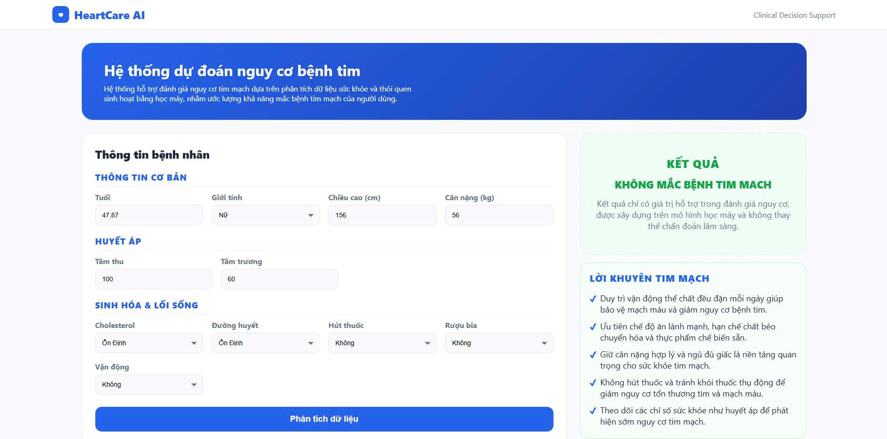

## Heart Disease Prediction System

Heart Disease Prediction System is a data-driven application that analyzes clinical and demographic features to predict the risk of heart disease using machine learning models. The system supports data preprocessing, model training, evaluation, and real-time prediction through a web-based interface, enabling early risk assessment and decision support in healthcare.

## Table of Contents

- [Installation](#installation)
- [Usage](#usage)
- [Demo](#demo)
- [License](#license)

## Installation

Make sure you have **Python 3.9** installed, java 8 and hadoop. Then install the required dependencies and start the server using the following commands:

1. Clone the repository

```bash
git clone https://github.com/HieuNguyen2910/heart_disease_prediction
cd heart_disease_prediction
```

2. Create and activate Conda environment

```bash
conda create -n your_enviroment python=3.9 -y
conda activate your_enviroment
```

3. Install required dependencies
```bash
pip install -r requirements.txt
```

## Usage
Run the Django Development Server
```bash
python manage.py runserver
```

Access the Web Application: 
open your browser and go to 
*(http://127.0.0.1:8000/)*

## Demo

Below is an example of heart disease prediction on a data.




